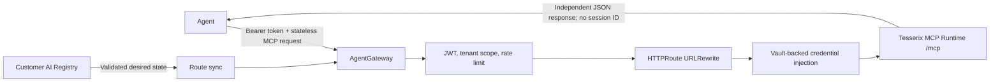

# ADR-0007: Stateless MCP uses HTTP pass-through at AgentGateway

Status: accepted · 2026-09-03

## Context and design envelope

The Customer AI Registry exports only platform-approved MCP servers declaring
protocol `2026-07-28`. That revision is request-independent: clients call
`server/discover` and `tools/list` independently and neither side creates an
`Mcp-Session-Id`. AgentGateway's MCP-aware backend currently performs legacy
initialization and session-aware routing, so it rejects these requests before
they reach a conforming Tesserix MCP Runtime.

Production has four active product routes (HomeChef, Mark8ly, platform, and
Stockpilot), below 20 requests/second at peak, with bounded JSON bodies. The
serving objective is 99.9% monthly availability and p99 below two seconds,
excluding downstream tool execution. Registry reconciliation remains outside
the request path.

The protected assets are tenant routing, caller identity, and vault-backed
upstream credentials. An unauthenticated caller, another tenant, or a
compromised workload must not select an arbitrary upstream or obtain the
credential injected by AgentGateway. Registry qualification, fixed backends,
gateway JWT policy, tenant scopes, NetworkPolicy, and credential references
remain enforced at their existing trust boundaries.

## Decision

Render a plain `AgentgatewayBackend.spec.static` for every exported stateless
MCP server and one HTTPRoute rule per public path. Each rule uses URLRewrite to
replace its matched prefix with the Registry-declared upstream path and its
hostname with the fixed upstream service host.

Tenant-qualified `/mcp/<tenant>/<server>` and unambiguous compatibility
`/mcp/<server>` paths are separate rules because each prefix must be replaced
independently. The upstream hostname and path come only from a
platform-approved Registry record; callers cannot supply either value.

## Alternatives considered

1. Keep `spec.mcp.targets`. Rejected because its protocol adapter attempts
   legacy initialization/session handling and is incompatible with
   `2026-07-28`.
2. Add compatibility sessions to Tesserix MCP Runtime. Rejected because it
   would violate the selected stateless protocol and reintroduce affinity and
   lifecycle state.
3. Expose product runtimes directly. Rejected because it bypasses central JWT,
   tenant authorization, rate limits, telemetry, and credential brokering.

## Consequences

AgentGateway handles these routes as ordinary HTTP while preserving all edge
and backend policies. It does not interpret MCP messages, manufacture session
IDs, or retry requests. A timeout returns to the caller; clients may retry only
safe reads and transient failures within their deadline. Duplicate independent
discovery/list calls have no stored state to corrupt.

Selector-based AgentGateway MCP discovery is intentionally not used for this
protocol revision. The registered URL is authoritative and NetworkPolicy
constrains the reachable product namespaces. Cost and capacity are unchanged:
the same gateway and route-sync replicas serve a four-route configuration.

Rollback is the prior route-sync image, which restores MCP-aware backend
rendering without changing Registry records or public route names. Rollback is
appropriate only if clients also return to the legacy protocol; otherwise the
known initialization mismatch returns.
